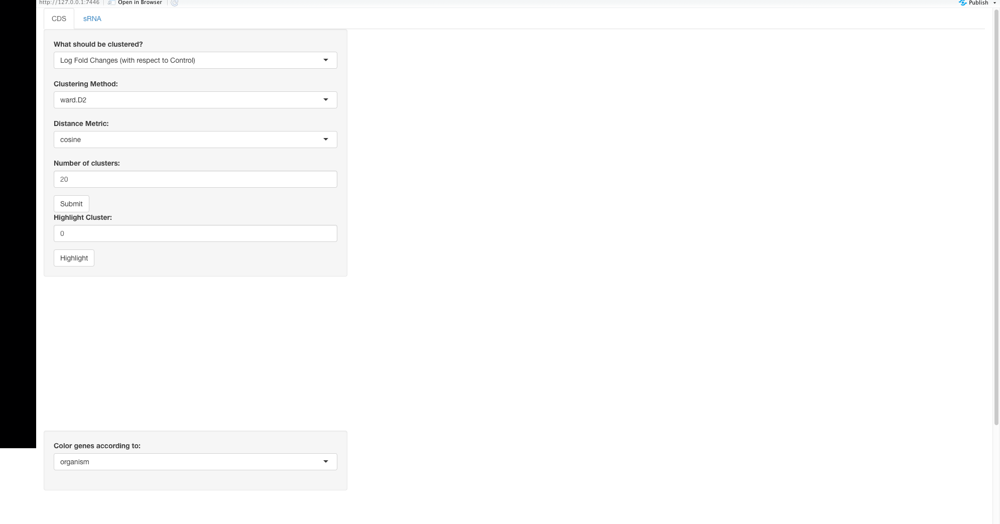
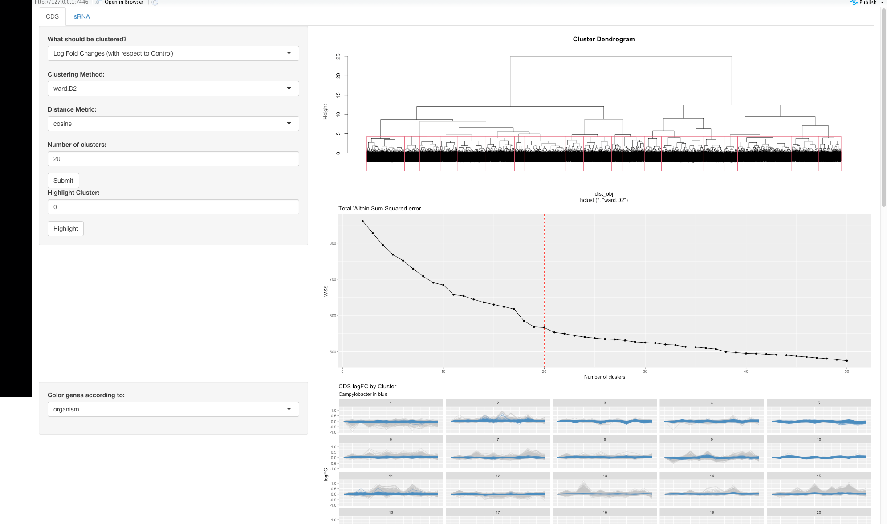
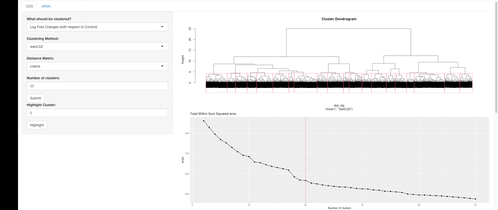
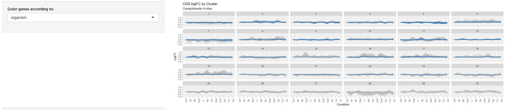
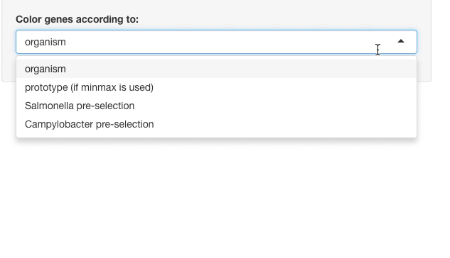
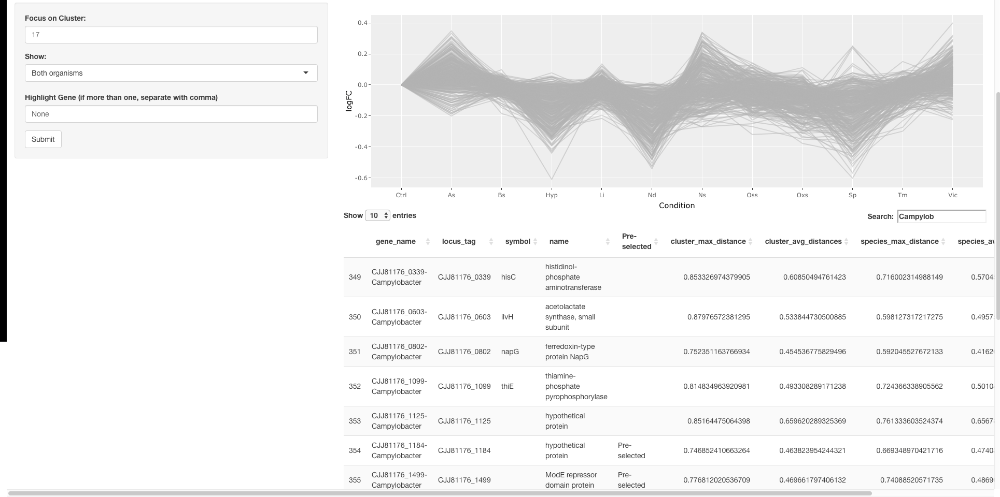
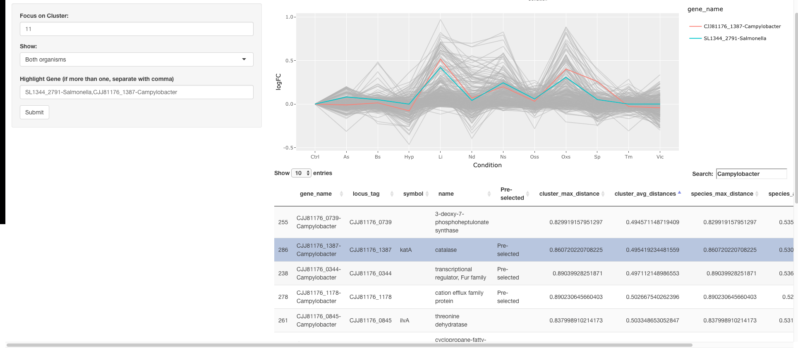
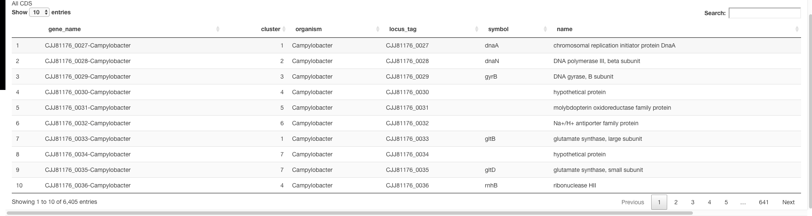

# A tool to visualize clustering results together  
So, I think we can benefit by looking at the data together. For that purpose, I have created this little app so that we can all easily perform clustering and look at the results.  
Here is a small tutorial on how to use it. I will also include just a little bit of my recommendations and observations.

## How do I use this?  
This is a shiny app built with R. I think the easiest way in which we can all use this is the following:  
1. Install R and Rstudio         

2. Install the following packages with **install.packages()**  
    + shiny
    + tidyverse
    + protoclust
    + plotly
    + DT
    + readxl  
    
3. Run the following command in the Rstudio console:
```{r, eval=FALSE}
runUrl("https://github.com/rolayoalarcon/reporter_app/raw/main/reporter_selection_app.zip")
```

Once you've done this, the app will begin to download on your computer and should eventually pop-up with a screen like this.  


After a few moments, the images should load and you will see something like this




Now we can do some data analysis!  
  
## What am I looking at?  

As you probably can tell from the past two images, there are two tabs: one for CDS clustering and one for sRNA clustering. Both pages have basically the same things, so I'll explain the CDS page in the following examples.  
  
Basically, the page has 4 main parts.

#### Part 1: Clustering   
This is the part of the page that corresponds to the first side-panel and the first two plots


On the side panel you will see the options we have for clustering our genes. The following parts of the analysis really depend on the options that we select here. 
A brief explanation is here below:  
  
1. **What should be clustered?**: Basically, here we have to select the data that will be used as input for the clustering. There are two options
    + Log Fold Changes (with respect to control): After normalizing the data, we calculate the log Fold Change in gene expression with respect to the control condition. This has been my default option for many analysis.
    The advantages are that we can group together genes that have a similar behavior, independent of the magnitude of change. Campylobacter genes and Salmonella genes are mixed within clusters, meaning that there isn't a cluster with only Campylobacter
    genes and another with only Salmonella genes. A disadvantage is that sometimes the clustering is too sensitive to similar behaviors. There are occasions where genes are clustered together because they react similary to one condition, but if we look closely they react differently in other conditions. In any case, this means that we have to pay close attention to what we choose as "representative"
    + Positive normalized counts (VST): These are the normalized counts. No Fold Change is considered. I have noticed that when we use this data, the genes grouped within the same cluster are definitely much more similar to eachother than when we use the log Fold Changes. This means that all of the genes react similarly to all conditions. However, there is an important drawback. Here, the magnitude of change plays a very important role. For some reason, Campylobacter genes do not seem to show big changes in gene expression in response to the different types of stress. While the Salmonella genes are clustered into very distinguishable groups, most Campylobacter genes are grouped together in a cluster where genes do not seem to change.
  
2. **Clustering Method**: Here we can choose what type of linkage should be used in order to cluster the distance matrix. I added several options for the sake of completeness, however I think there are really only two options that are really convenient ot us:
    + ward.D2: This algorithm creates clusters by trying to reduce the dissimilarity between members.
    + minmax: This algorithm tries to reduce the highest maximum distance that a given member can have with respect to everyone else in the cluster. This method has the added advantage of automatically selecting a representative for each cluster.
  
3. **Distance Metric**: How we should consider the genes to be separated. Here, it really makes sense to group based on similarity measurements. Therefore, we can use correlation metrics or the cosine similarity. Previously, I had concerns about using the log Fold Change values along with these distance metrics. Since log Fold Changes can be negative and positive, it opens the possibility of having negative correlation coefficients (and cosine angles). This could mess up the distance matrix, since, in order to turn the correlation coefficient into a dissimilarity measurement we do $1-correlation$. If the correlation coefficient is -1, then the distance would end up being 2. However, I was now able to apply some transformations to keep all distances between 0 and 1. So there really is no issue. 
  
4. **Number of clusters**: Pretty straightforward. How many clusters do we want to divide our data into. We can base this on anything we want really. To give a little reference, I added a plot that shows the Total Within-group Sum of Squared distance (WSS) as a function of the number of clusters (I explain this more in detail below).

These are the main parameters for clustering. Once you have chosen the options you think are right you can click **Submit** and the whole analysis will be run.

Next we have two plots:  
1. Dendrogram: This is a representation of how the genes were clustered. The red boxes mark the different clusters. If there is a specific cluster you are interested in, and you want to know where it is in the dendrogram, you can enter it into the **Higlight Cluster** box.  
  
2. Total WSS as a function of the number of clusters: There are a lot of different criteria that can guide the choice of the number of clusters. One the simplest ones, is to look at the Within-group Sum of Squared distance. Basically, we can get an idea of how similar the members of a cluster are, by adding up the squared distances between the members of the cluster and the *average point* of the cluster. The smaller the sum of the squared distances, the more similar the members of the cluster are to eachother. We use the following formula:

$$WSS_k = \sum_{l=1}^{k} \sum_{x_i \in C_l} d^2(x_i, \overline{x}_l)$$

Where $k$ stands for the total number of clusters, $C_l$ is the set of objects within the $l$th cluster and $\overline{x}_l$ is the average point within the cluster. Say, for example, that $k=2$. We would then calculate the WSS of the members of cluster 1  and the WSS for the memebers of cluster 2 and then add them together to get the *Total WSS* for $k=2$. We then do the same for $k=3$ and so on. The more clusters we create, the smaller they will be, and the more similar the members will be to eachother. Therefore, it is normal to see that as the number of clusters increases, the Total WSS decreases. Normally, we look for an *elbow* in the graph. Meaning we look for the first $k$ where the Total WSS stops changing drastically. In our case, the red line in the graph just sereves as an indicator of cluster similarity at our chosen $k$.  

  
#### Part 2: Gene Expression profiles for each cluster.  
  
Now that we have done clustering, we can assign each gene to a cluster. This allows us to visually inspect the behavior of the genes of each cluster.   
  

Each subplot shows the log Fold Change with respect to control of each gene in that cluster.   
At first, you will see that the genes are colored according to each organism (Campylobacter in blue). There are more options:
  

  
Both of you sent me some genes you are interested in looking at. Therefore, you can choose to highlight you're pre-selected genes. **In the case of Campylobacter**, only the clusters that have Campylobacter genes are shown. Genes of interest are green, while the genes marked with **cloning** are in brown.  
  
The option of the prototype would highlight the automatically selected gene by minmax linkage. Otherwise, it won't do anything.  
  
#### Part 3: Focusing on a specific cluster
Now that we have an idea of what the clusters look like, we can choose to focus on a specific cluster.


In the sidebar, you can write the number of the cluster that you want to focus on. The plot that appears is interactive, so have fun with that! Also, the table below shows some info about the genes in the cluster that you selected.  
Also, you can choose whether to show genes from both organisms, or only one of them. Finally, you can choose to highlight a specific gene, using the **gene_name** column from the table directly below. If you are interested in more than one gene, you can separate the names using a ",". **Do not** leave a space after the ",". If you want to focus on another cluster, make sure "None" is written in the Highlight Gene box before changing.

Below is an example of how you can highlight two genes in the same cluster


Some details about the numbers in the table below: In order to automatically select representative genes, I am basing myself on the distances of each member to all others members in the cluster (cluster_[max, avg]_distance). I give preference to genes whose cluster_avg_distances is lower.   
Finally, Average_Expression is the mean number of normalized counts each gene has across all experiments.  
  
#### Part 4: Looking at all of the genes  
So far, we have seen how to look at the genes within a cluster. However, it is also possible to search for a particular gene, and see which cluster it is assigned to. The table all the way down below has that info.  
  
  
Happy Searching!
